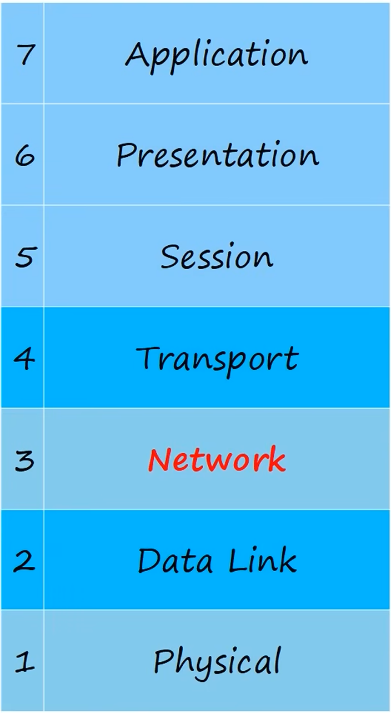
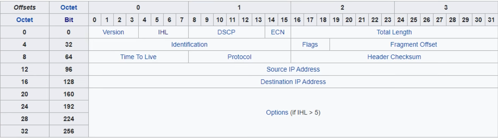
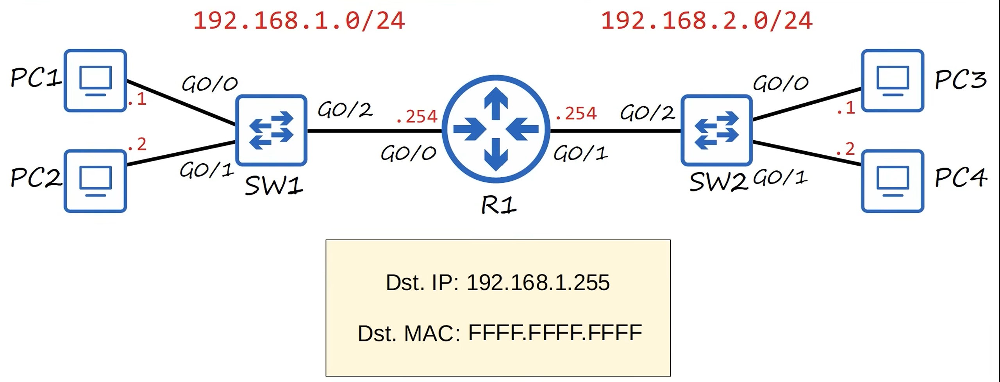

# Day 7 – IPv4 Addressing (CCNA 200-301)

## OSI Model – Network Layer (Layer 3)



* Provides connectivity between end hosts on **different networks** (outside the LAN)
* Provides **logical addressing** (IP addresses)
* Performs **path selection** between source and destination
* **Routers operate at Layer 3**

---

## IPv4 Overview

* IPv4 uses **32-bit logical addresses**
* Written in **dotted-decimal notation** (four octets)
* Used by routers to forward packets between networks

---

## IPv4 Header



* Minimum header size: **20 bytes**
* Maximum header size: **60 bytes** (with options)

### IPv4 Header Fields

| Field           | Size (bits) | Description             |
| --------------- | ----------- | ----------------------- |
| Version         | 4           | IP version (IPv4 = 4)   |
| IHL             | 4           | Header length           |
| DSCP            | 6           | QoS marking             |
| ECN             | 2           | Congestion notification |
| Total Length    | 16          | Packet size             |
| Identification  | 16          | Fragment ID             |
| Flags           | 3           | Fragment control        |
| Fragment Offset | 13          | Fragment position       |
| TTL             | 8           | Packet lifetime         |
| Protocol        | 8           | Upper-layer protocol    |
| Header Checksum | 16          | Header error check      |
| Source IP       | 32          | Sender IP address       |
| Destination IP  | 32          | Receiver IP address     |

---

## Network Portion vs Host Portion

Example:

```
154.78.111.32/16
```

* `/16` → first 16 bits = **network portion**
* Remaining 16 bits = **host portion**

Network address:

```
154.78.0.0/16
```

---

## IPv4 Address Classes

### Classful Addressing Table

| Class | First Octet (Binary) | Range   | Default Prefix | Default Mask  |
| ----- | -------------------- | ------- | -------------- | ------------- |
| A     | 0xxxxxxx             | 1–126   | /8             | 255.0.0.0     |
| B     | 10xxxxxx             | 128–191 | /16            | 255.255.0.0   |
| C     | 110xxxxx             | 192–223 | /24            | 255.255.255.0 |
| D     | 1110xxxx             | 224–239 | N/A            | Multicast     |
| E     | 1111xxxx             | 240–255 | N/A            | Reserved      |

---

## IPv4 Classes – Capacity

| Class | Network Bits | Host Bits | Networks  | Addresses per Network |
| ----- | ------------ | --------- | --------- | --------------------- |
| A     | 8            | 24        | 128       | 16,777,216            |
| B     | 16           | 16        | 16,384    | 65,536                |
| C     | 24           | 8         | 2,097,152 | 256                   |

> Total addresses include network and broadcast addresses.

---

## Netmask (Default Subnet Masks)

| Class | Prefix | Netmask       | Binary                              |
| ----- | ------ | ------------- | ----------------------------------- |
| A     | /8     | 255.0.0.0     | 11111111 00000000 00000000 00000000 |
| B     | /16    | 255.255.0.0   | 11111111 11111111 00000000 00000000 |
| C     | /24    | 255.255.255.0 | 11111111 11111111 11111111 00000000 |

---

## Loopback Addresses

* Address range: `127.0.0.0 – 127.255.255.255`
* Used to test the **local TCP/IP stack**
* Traffic never leaves the device
* Common loopback address:

  ```
  127.0.0.1
  ```

---

## Network Address

* Host portion is **all 0s**
* Identifies the network
* **Cannot be assigned to a host**

Example:

```
192.168.1.0/24
```

---

## Broadcast Address

* Host portion is **all 1s**
* Used to reach **all hosts in the local subnet**
* **Cannot be assigned to a host**

Example:

```
192.168.1.255
```

### Broadcast at Layer 2



```
Destination IP: 192.168.1.255
Destination MAC: FFFF.FFFF.FFFF
```

* Switch floods broadcast frames
* Routers do **not** forward broadcasts

---

## Network vs Broadcast Summary

| Address Type | Host Bits | Assignable | Purpose         |
| ------------ | --------- | ---------- | --------------- |
| Network      | All 0s    | No         | Identify subnet |
| Broadcast    | All 1s    | No         | Reach all hosts |

---

## CCNA Exam Key Takeaways

* IPv4 = 32 bits
* Classful defaults: A=/8, B=/16, C=/24
* Network address = first address
* Broadcast address = last address
* Broadcast MAC = `FFFF.FFFF.FFFF`
* Routers block broadcasts by default
