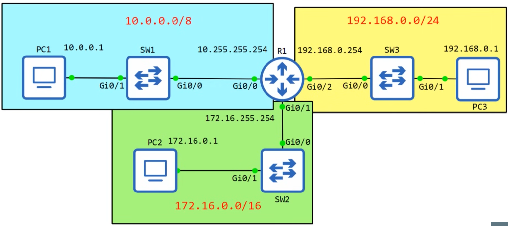

```md
# Day 8 – IPv4 Addressing (Part 2)
_CCNA 200-301_

---

## IPv4 Addressing – First and Last Usable Address (Topology Example)



---

## IPv4 Address Classes (Quick Review)

| Class | Leading Bits | First Octet Range | Default Mask |
|------|-------------|------------------|--------------|
| A | 0 | 1 – 126 | /8 |
| B | 10 | 128 – 191 | /16 |
| C | 110 | 192 – 223 | /24 |
| D | 1110 | 224 – 239 | Multicast |
| E | 1111 | 240 – 255 | Experimental |

**Reserved values (Class A):**
- `0.x.x.x` → Reserved
- `127.x.x.x` → Loopback

---

## Maximum Hosts per Network

### General Formula
```

Maximum hosts = 2^n − 2

```
- `n` = number of host bits  
- `−2` accounts for:
  - Network address
  - Broadcast address

---

### Example 1: `/24` Network
- Host bits = 8  
- Total addresses = 2⁸ = 256  

```

Usable hosts = 256 − 2 = 254

```

---

### Example 2: `/8` Network
- Host bits = 24  
- Total addresses = 2²⁴ = 16,777,216  

```

Usable hosts = 2^24 − 2 = 16,777,214

````

---

## First and Last Usable Address

### Example: `192.168.1.0/24`

| Type | Address |
|----|--------|
| Network address | `192.168.1.0` |
| First usable | `192.168.1.1` |
| Last usable | `192.168.1.254` |
| Broadcast address | `192.168.1.255` |

**Rules:**
- First usable = network address + 1  
- Last usable = broadcast address − 1  

---

## IPv4 Addressing – Multiple Networks Example

| Network | Prefix | First Usable | Last Usable |
|------|-------|-------------|-------------|
| 10.0.0.0 | /8 | 10.0.0.1 | 10.255.255.254 |
| 172.16.0.0 | /16 | 172.16.0.1 | 172.16.255.254 |
| 192.168.0.0 | /24 | 192.168.0.1 | 192.168.0.254 |

---

## Checking Interface Status

### Command
```text
show ip interface brief
````

### Output Meaning

| Column   | Description         |
| -------- | ------------------- |
| Status   | Layer 1 (Physical)  |
| Protocol | Layer 2 (Data Link) |

**Common states:**

* `administratively down / down` → Interface shut down
* `down / down` → Physical issue
* `up / down` → Layer 2 problem
* `up / up` → Interface operational

**Default behavior:**

* Router interfaces → administratively down
* Switch interfaces → enabled by default

---

## Entering Interface Configuration Mode

### Commands

```text
enable
configure terminal
interface gigabitethernet 0/0
```

**Abbreviated form (allowed):**

```text
int g0/0
```

Prompt changes to:

```text
(config-if)
```

---

## Assigning an IPv4 Address to an Interface

### Configure IP Address

```text
ip address 10.255.255.254 255.0.0.0
```

### Enable the Interface

```text
no shutdown
```

### Verify Configuration

```text
do show ip interface brief
```

Expected state:

```
up     up
```

---

## Detailed Interface Information

### Command

```text
show interfaces g0/0
```

### Key Information Displayed

* Layer 1 and Layer 2 status
* IP address and prefix
* MTU, bandwidth, delay
* Traffic statistics
* Error counters

**Usage:**

* Deep troubleshooting
* Physical and Layer 2 diagnostics

---

## Quick Interface Overview

### Command

```text
show interfaces description
```

### Purpose

* Fast operational status check
* No traffic statistics
* Displays interface descriptions

---

## Configuring Interface Descriptions

### Commands

```text
interface g0/0
description ## to SW1 ##

interface g0/1
description ## to SW2 ##

interface g0/2
description ## to SW3 ##
```

### Verify

```text
do show interfaces description
```

---

## Key CCNA Exam Takeaways

* Network and broadcast addresses are **not usable**
* Always subtract **2** when calculating hosts
* Router interfaces require **`no shutdown`**
* `show ip interface brief` → quick check
* `show interfaces` → detailed troubleshooting
* Interface descriptions improve documentation only
