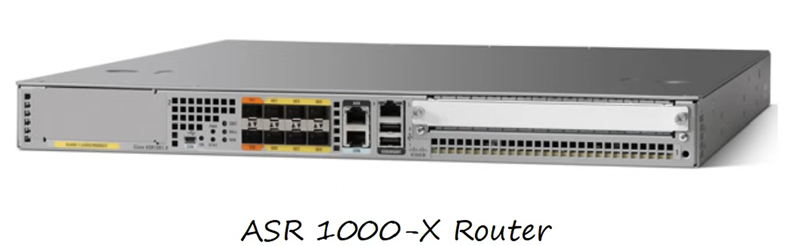
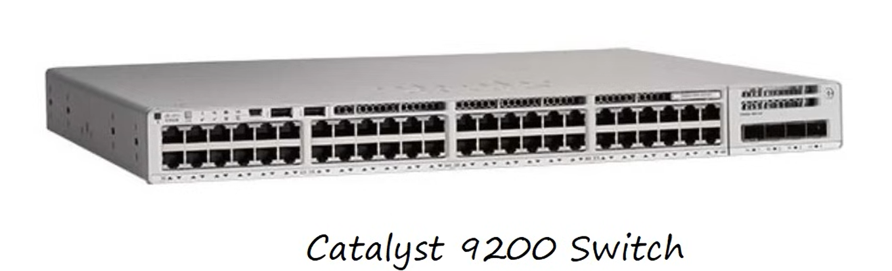
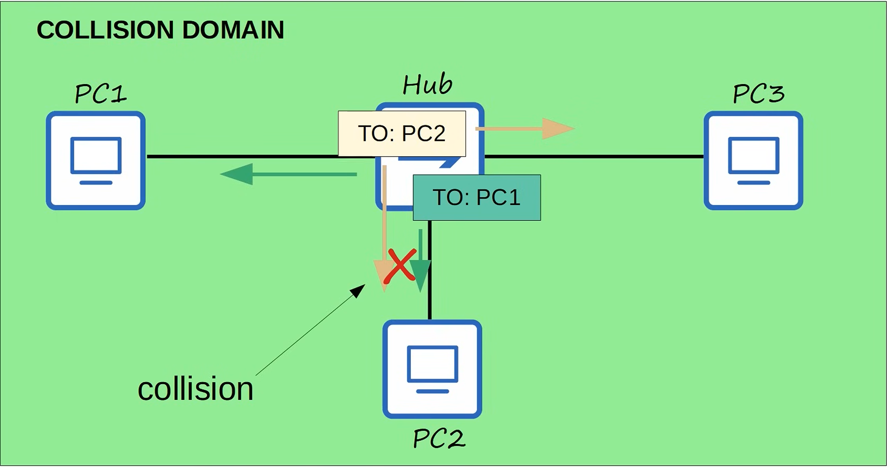
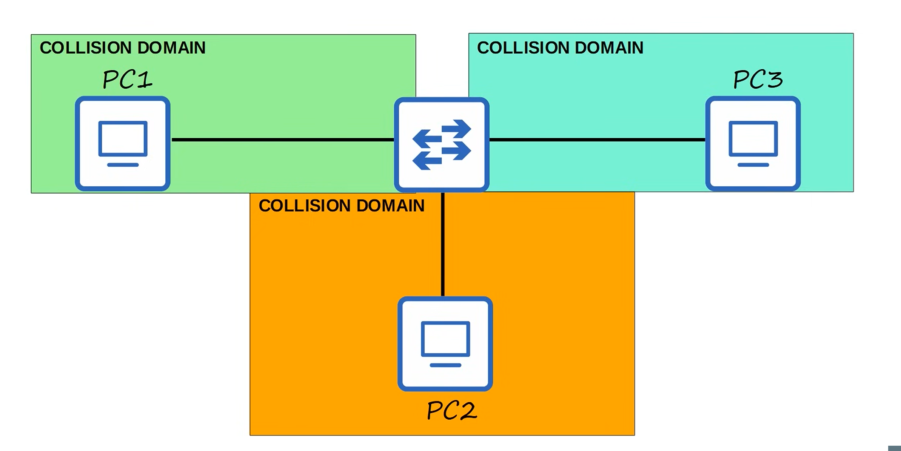
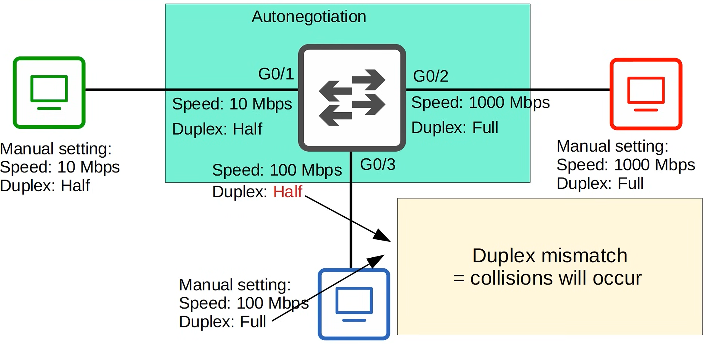
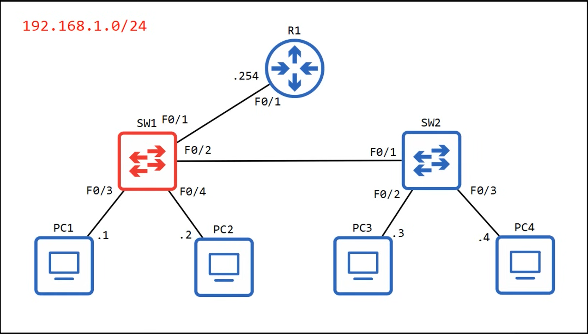

# Day 9 – Switch Interfaces (CCNA 200-301)

---

## 1. Network Devices Used in This Lab

### Router – Cisco ASR 1000-X



Used as the Layer 3 device (default gateway) connecting different networks.

### Switch – Cisco Catalyst 9200



Used as the Layer 2 device to connect end devices and forward Ethernet frames.

Configuring Switch Interfaces

### 1.1 Interface Speed Configuration

Interfaces that support multiple speeds (10/100 or 10/100/1000) can be manually configured.

**Commands:**

```bash
SW1# conf t
SW1(config)# interface f0/1
SW1(config-if)# speed ?
  10    Force 10 Mbps operation
  100   Force 100 Mbps operation
  auto  Enable AUTO speed configuration

SW1(config-if)# speed 100
```

---

### 1.2 Interface Duplex Configuration

Duplex mode determines whether a device can send and receive at the same time.

**Commands:**

```bash
SW1(config-if)# duplex ?
  auto  Enable AUTO duplex configuration
  full  Force full duplex operation
  half  Force half-duplex operation

SW1(config-if)# duplex full
```

---

### 1.3 Interface Description

Descriptions are used for documentation and troubleshooting.

**Command:**

```bash
SW1(config-if)# description ## to R1 ##
```

---

### 1.4 Verifying Interface Status

**Command:**

```bash
SW1# show interfaces status
```

**Sample Output:**

```text
Port   Name           Status      Vlan   Duplex  Speed  Type
Fa0/1  ## to R1 ##    connected   1      full    100    10/100BaseTX
Fa0/2  ## to SW2 ##   connected   trunk  a-full  a-100  10/100BaseTX
Fa0/3  ## to hosts ## connected   1      a-full  a-100  10/100BaseTX
```

---

## 2. Interface Range

Interface range allows configuring multiple interfaces at once.

### 2.1 Disabling Unused Interfaces

**Commands:**

```bash
SW1(config)# interface range f0/5 - 12
SW1(config-if-range)# description ## not in use ##
SW1(config-if-range)# shutdown
```

**Result:**

```text
%LINK-5-CHANGED: Interface FastEthernet0/5, changed state to administratively down
```

---

### 2.2 Enabling Selected Interfaces

**Commands:**

```bash
SW1(config)# interface range f0/5 - 6 , f0/9 - 12
SW1(config-if-range)# no shutdown
```

---

### 2.3 Verifying Interface Range Configuration

**Command:**

```bash
SW1(config-if-range)# do show interfaces status
```

**Sample Output:**

```text
Fa0/5  ## not in use ##  disabled  1  auto  auto  10/100BaseTX
Fa0/6  ## not in use ##  disabled  1  auto  auto  10/100BaseTX
```

---

## 3. CSMA/CD

**Carrier Sense Multiple Access with Collision Detection**

* Devices listen before transmitting
* Collisions are detected
* A jamming signal is sent
* Devices wait a random time before retrying

**Used only on half-duplex Ethernet interfaces**

---

## 4. Collision Domains

### Collision Domain with Hub



All devices connected to a hub share **one collision domain**. Collisions are common.

### Collision Domains with Switch



Each switch port creates a **separate collision domain**, eliminating collisions in full-duplex mode.

Collision Domains

* A **collision domain** is a network segment where collisions can occur

### 4.1 Hub

* All connected devices share **one collision domain**
* Operates in **half duplex**
* Collisions are common

### 4.2 Switch

* Each switch port is a **separate collision domain**
* Supports **full duplex**
* Collisions do not occur in full-duplex mode

---

## 5. Full Duplex vs Half Duplex

### Half Duplex

* Cannot send and receive at the same time
* Must wait before transmitting
* Uses CSMA/CD
* Required when connected to a hub

### Full Duplex

* Can send and receive simultaneously
* No collisions
* Used on switch connections

---

## 6. Duplex and Speed Autonegotiation

### Autonegotiation and Duplex Mismatch



Illustrates how duplex mismatches occur when one side uses manual configuration and the other uses autonegotiation.

Speed/Duplex Autonegotiation

* Default setting: `speed auto`, `duplex auto`
* Devices advertise their capabilities
* Best common speed and duplex is selected

---

### 6.1 Autonegotiation Disabled on One Side

#### Speed Behavior

* Switch attempts to sense speed
* If sensing fails → slowest supported speed is used

#### Duplex Behavior

* Duplex cannot be sensed
* Rules:

  * 10 or 100 Mbps → Half duplex
  * 1000 Mbps or higher → Full duplex

---

### 6.2 Duplex Mismatch

* One side full duplex, other side half duplex
* Causes:

  * Collisions
  * CRC errors
  * Poor performance

---

## 7. Interface Errors

### 7.1 Viewing Interface Errors

**Command:**

```bash
SW1# show interfaces f0/2
```

---

### 7.2 Important Error Counters

* **Runts** – Frames smaller than 64 bytes
* **Giants** – Frames larger than 1518 bytes
* **CRC** – Failed FCS check
* **Frame** – Incorrect frame format
* **Input errors** – Total of input-related errors
* **Output errors** – Frames failed during transmission

---

## 8. Lab Topology Overview



This topology is used to demonstrate interface speed, duplex, collision domains, and error counters.

Quiz Summary (Key Exam Points)

* Duplex mismatch → **Collisions will occur**
* Half duplex uses **CSMA/CD**
* Interface errors viewed using `show interfaces`
* Errors include **Runts, Giants, CRC**
* Autonegotiation disabled → **Speed may be sensed, duplex defaults**

---

## End of Day 9 Notes
